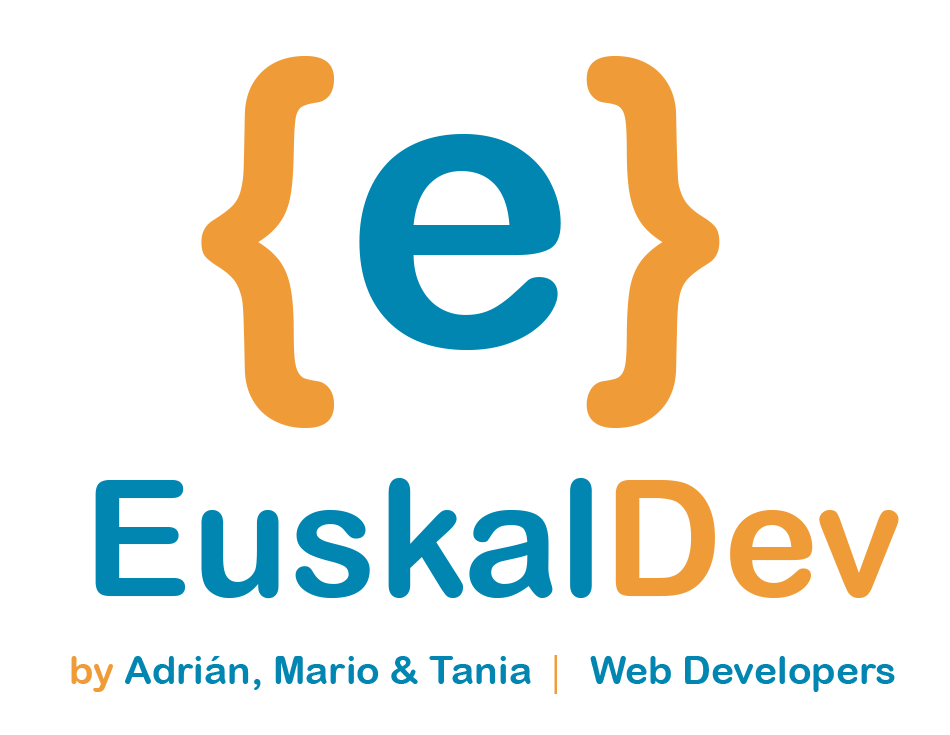
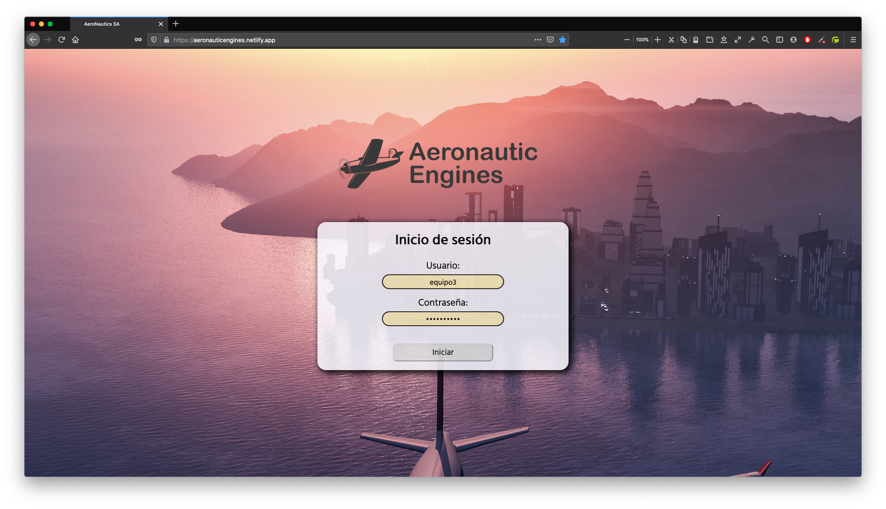
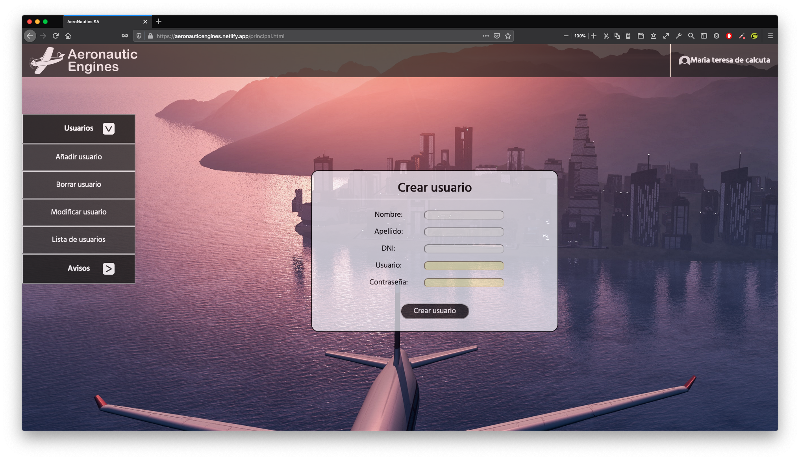
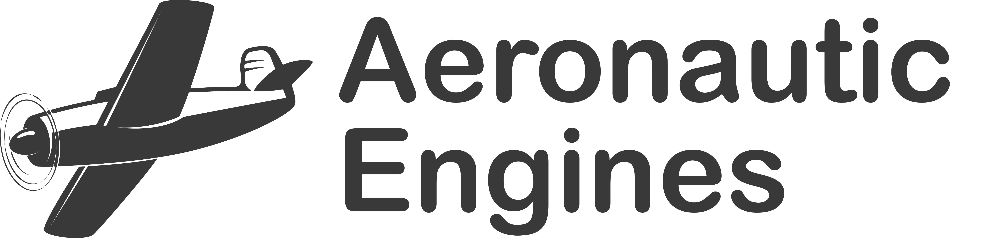

# Aeronautic Engines S.A
## Introuducción
Portal desarrollado por EuskalDev para la empresa Aeronautic Engines S.A.    
Este portal pretende:      

*  Iniciar sesión en una intranet privada.
*  CRUD de usuarios para el portal.
*  Anuncios para que cada usuario pueda hacer el suyo. También CRUD.
*  Datos guardados en LocalStorage mediante JSON.
*  Trabajar con los diferentes lenguajes de marcados, cascada y de programación: HTML5, CSS3, JS3.

## Documentación
*  [Git Development Model]()
*  [Manual de Usuario]()
*  [Guía de Estilo (Boceto, Mock Up, Colores, Fuentes, etc.)]()

## Desarollador por
Desarrollador por EuskalDev: [Adrián](https://github.com/adrianpisabarrogarcia), [Mario](https://github.com/mariozaton01), [Tania](https://github.com/TaniaGarciaOlarte).   
  

## Capturas del Portal

  
  

## Logotipo de A.E. S.A.    
  
